<h1 align="center">
  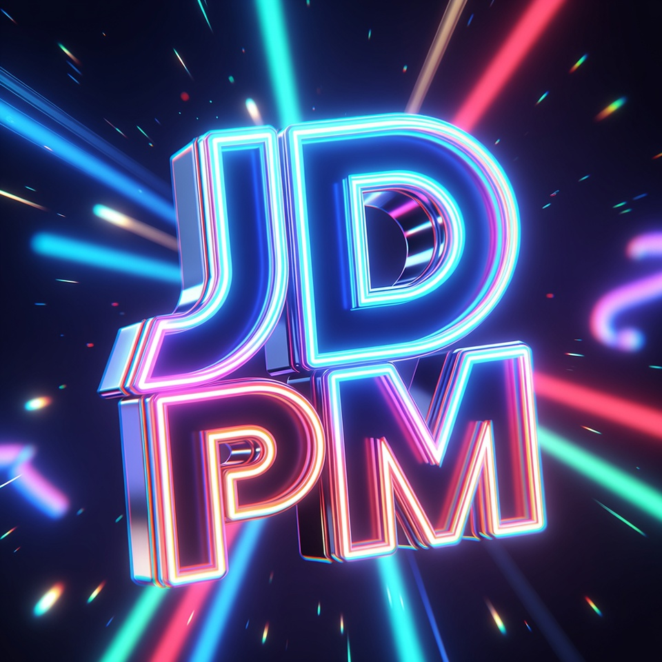
  Just Dance 2022 Legacy MOD (Switch) Playlist Manager
</h1>

<p align="center">
  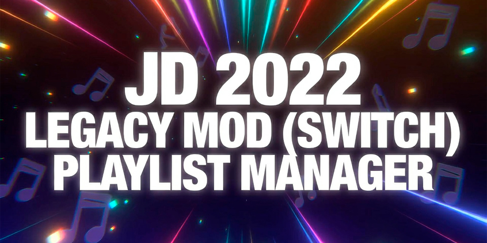
</p>

<p align="center">
  
  
</p>
<p align="center">
  
  
</p>

<h3 align="center"> A GUI tool to manage, create, and organize playlists for the *Legacy MOD* on Just Dance 2022 (Switch) by scanning and editing MOD files and locales.</h2>

This software is a dedicated manager for users of the **Just Dance 2022 Legacy MOD** on Nintendo Switch. It provides a visual interface to handle the complexity of playlist files, allowing for deep customization of how songs are organized in-game.
The tool scans the MOD's directory, extracts necessary data, and allows the user to manipulate sections and playlists without manual JSON editing.

<p align="center">
  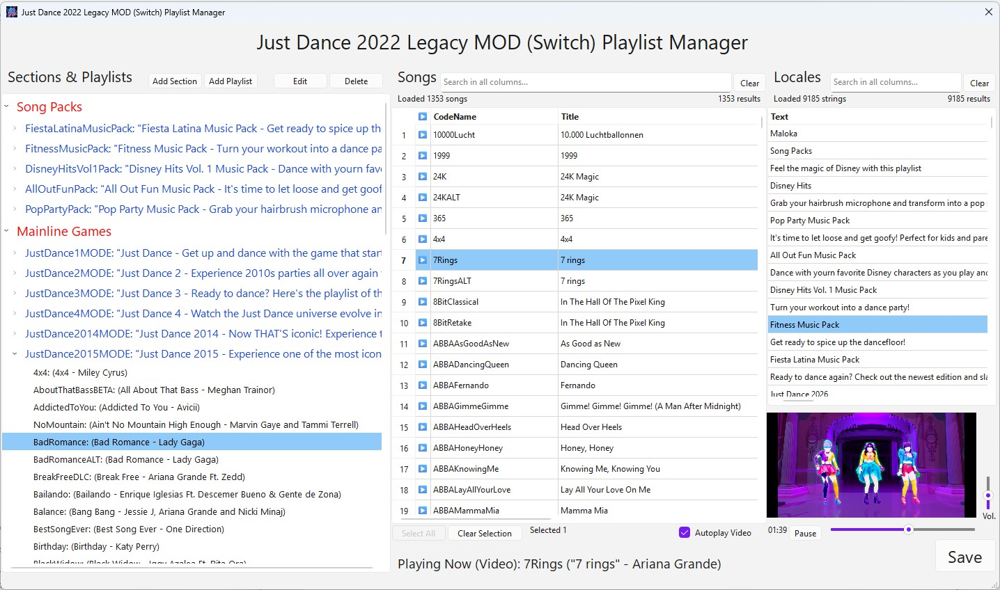
</p>

---

<div align="center">
  <table style="border: none;">
    <tr style="border: none;">
      <td style="border: none; text-align: left; padding: 0;">

<h2 align="center">Table of Contents</h2>

<p align="left" style="line-height: 1.2;">
• <a href="#key-features">Key Features</a><br>
• <a href="#quick-download--installation-for-users">Quick Download & Installation For Users</a><br>
• <a href="#how-to-use">How to Use</a><br>
• <a href="#detailed-features">Detailed Features</a><br>
• <a href="#faq">FAQ</a><br>
• <a href="#contributing">Contributing</a><br>
• <a href="#installation-for-developers">Installation For Developers</a><br>
• <a href="#disclaimer">Disclaimer</a><br>
• <a href="#credits">Credits</a><br>
• <a href="#license">License</a>
</p>
  </table>
</div>


## Key Features
* **Visual Playlist Editor:** Create, edit, delete, and reorder playlists and their respective sections.
* **Smart Song Mapping:** Automatically identifies CodeNames, Song Titles, and Artists by scanning MOD files.
* **Drag-and-Drop Workflow:** Easily add songs to playlists using the graphical interface.
* **Media Preview:** Built-in video and audio player to preview songs (coaches/versions) before adding them to a playlist.
* **Cover Art Management:** Customize the playlist covers that appear in the game menu.
* **Locale Synchronization:** Automatically updates game locale files to match your custom playlist names.

## Quick Download & Installation For Users
1. **[Download Latest Release (.zip)](https://github.com/vguasta/jd-legacy-mod-playlist-manager/releases)**
2. Extract the `.zip` file to your desired location.
3. Run the `JD2022LMPlaylistManager.exe`.

**Note:** *The `.zip` includes the executable and the optional `./runtime/songs.json` file. Some antivirus software may flag the executable as a false positive due to it being unsigned. It is recommended to add an exception for the installation path.*


## How to Use
1. **Source Files:** You must provide your own files from the Just Dance 2022 Legacy MOD.
2. **Setup:** Open the software and point it to your MOD's root directory.
3. **Scan:** The program offers three ways to load the MOD files and song database, explained below.
4. **Edit:** Create your playlists, drag songs into them, and set your covers.
5. **Save:** Apply changes. The software will update the MOD's structure and locales.

## Detailed Features

### Loading MOD Files: Three Modes

You can load the MOD files and song database in three different ways. Regardless of the type of load you choose, the patch_nx.ipk from your mod will be copied to the [patch_nx_backups folder](app/patch_nx_backups) and renamed with the date of the copy. You can remove the date and replace the file in your MOD folder at any time.

**Extracting patch_nx.ipk from your mod is required for all modes.**

<div align="center">
  <table style="border-collapse: collapse; border: none; border-spacing: 0; background-color: transparent;">
    <tr style="border: none; background-color: transparent;">
      <td style="border: none; vertical-align: middle; padding: 10px;">
        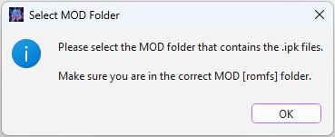
      </td>
      <td style="border: none; vertical-align: middle; padding: 10px;">
        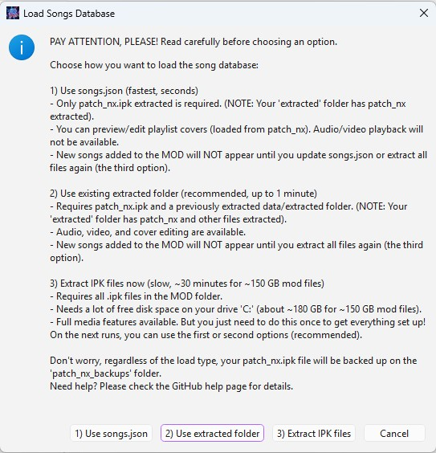
      </td>
      <td style="border: none; vertical-align: middle; padding: 10px;">
        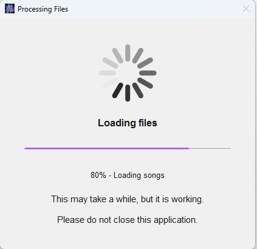
      </td>
    </tr>
  </table>
</div>

---
Each mode is explained in the program interface and below:

- **Mode 1:** Use [songs.json](app/runtime/songs.json)

This is the most basic and fastest way to create your playlists. It was designed for users who don’t have enough disk space to extract all the MOD content, or don’t mind not being able to preview audio and video (after all, this can be found on YouTube).

With this mode, you can create, edit, delete, and reorder sections, playlists, and songs. You can also view, edit, and add covers to your playlists. However, you cannot preview coach videos or listen to the audio of each song in the table. Additionally, if a new song is added to the MOD by the modders, the songs.json file will only be updated if a full extraction is performed.

<p align="center">
   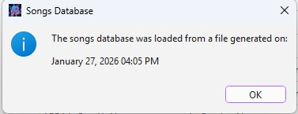
</p>

---
- **Mode 2:** Use [extracted folder](app/runtime/extracted)

This mode can only be used by those who have already extracted all the .ipk files from the MOD previously using mode 3.

Since extracting files takes a long time, it wouldn’t make sense to do this every time you open the Playlist Manager, so this option becomes useful.

With this mode, you can do everything included in mode 1, as well as preview the audio and video of the songs. However, if a new song is added to the MOD by the modders, you will still need to re-extract the IPK files using mode 3 for the data, videos, and audio to appear in the program.

---

- **Mode 3:** Extract IPK files

This is the slowest and most complete mode. It extracts all .ipk files from your mod folder to the [runtime/extracted folder](app/runtime/extracted). The extracted files remain after closing the Playlist Manager, and songs.json is updated as soon as extraction is finished.

> [!CAUTION]
> **Unfortunately, since the Legacy MOD is already around 150GB, you will need about 180GB of free disk space to perform the extraction, and the whole process can take around 30 minutes.**

If new songs are added to the MOD, you will need to extract all the content again so these songs appear in the songs table.

---

### Creating and Editing Sections
You can create new sections or edit existing ones using the interface. Double-click or use the appropriate button to add, edit, or remove sections.

<p align="center">
   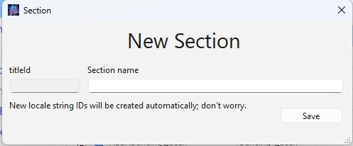
   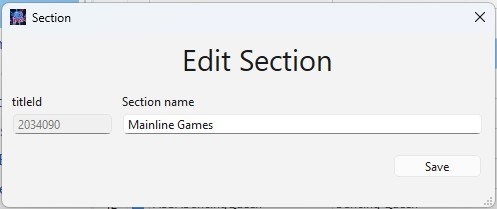
</p>

---

### Creating and Editing Playlists
Double-click or use the appropriate button to add, edit, or delete playlists.

You can add or edit the covers of your playlists that will appear in the game; however, **only .png images with exact dimensions of 1024x512 are allowed**. If you don’t want to use a custom image, you can use the default cover as shown in the interface.

<p align="center">
   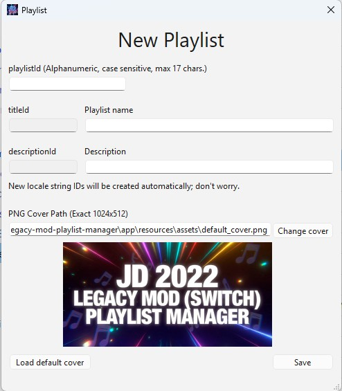
   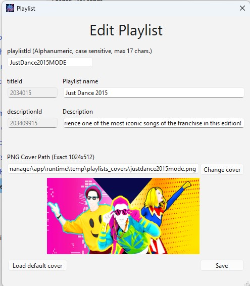
</p>

---

### Deleting Sections, Playlists and Songs
Sections, playlists, and songs can be deleted by selecting the rows and clicking the delete button or pressing the DEL key. Be careful, as this action cannot be undone. If you delete a section or a playlist, all content inside will be deleted as well.

<p align="center">
   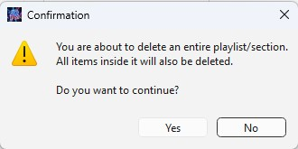
</p>

---

### Adding Songs to Playlists

Drag and drop songs from the Songs table into playlists.
Use Ctrl or Shift to select multiple songs.

**Only for load mode 2 or 3:** You can preview a song’s video (coach) by clicking on the row in the Songs table. You can listen to the audio by clicking the Play emoji (▶️) in the table.

<p align="center">
   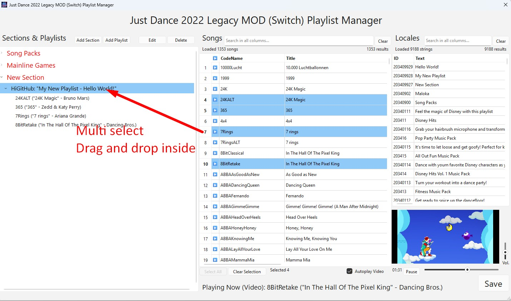
</p>

---

### Reordering Sections, Playlists and Songs

You can change the order of sections, playlists and songs by dragging them to the desired position. You can move an entire playlist from one section to another; the songs in that playlist will remain inside it. You can also move a song from one playlist to another.

<p align="center">
   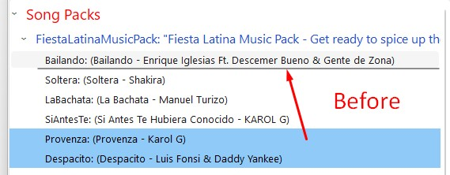
   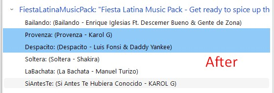
</p>

---

### Missing Songs Warning

Some songs may have their CodeName not found in the songs table and will therefore appear in red within the Playlist. There are a few possible reasons for this:

**If this song appears in your game:** Most likely, your songs.json (when using Load Mode 1) or extracted folder (when using Load Mode 2) is outdated. It is recommended to use Load Mode 3 to update the files.

**If this song does not appear in your game and your files are updated:** Then this is a CodeName that actually does not exist in the MOD files. The CodeName is case-sensitive, so by searching for a similar name in the Songs table, you might find the missing song (this is what the interface suggests). In any case, songs with invalid CodeNames do not cause the game to crash; the only thing that happens is that they will not appear. You can remove them or just leave them there.

<p align="center">
   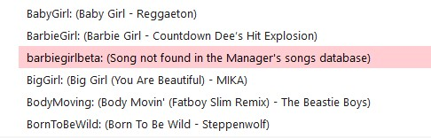
</p>
<p align="center">
   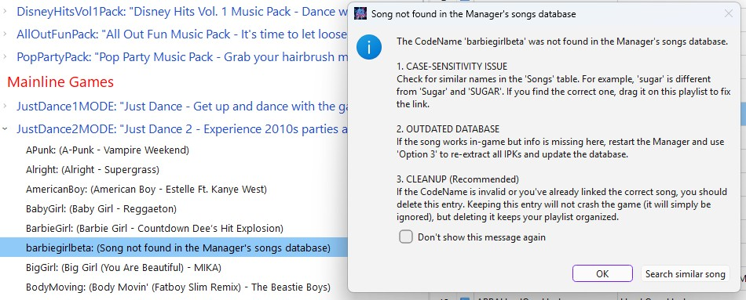
</p>
<p align="center">
   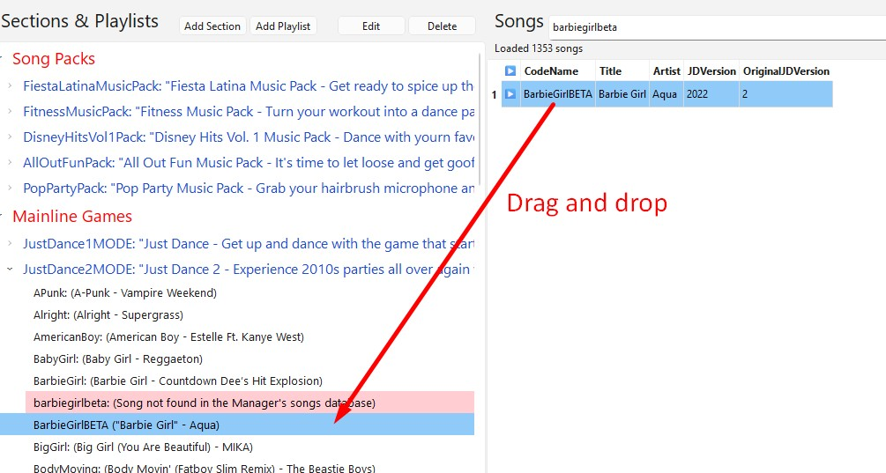
</p>

---

### Locales Strings
Section and playlist locales strings are created, removed, and updated automatically.

But, you can double-click any cell in the Locales table to manually edit a locale (not recommended unless you know what you're doing). IDs cannot be edited.

<p align="center">
   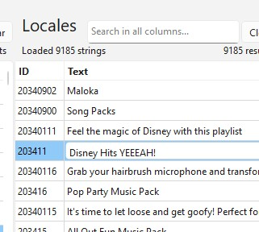
</p>

> [!CAUTION]
> **The Playlist Manager reads the English localisation file but replaces the localisation files for all languages!**

If you want it to read the localisation file of another language, go to `/runtime/extracted/patch_nx/enginedata/localisation`, make a copy of your language’s file, and rename the copy to `localisation.itf_language_english.loc8`, replacing the existing file.

---

### Extra Features
- Use Ctrl or Shift to select multiple songs, sections, or playlists at once.
- You can navigate the section/playlist tree and the song table using your keyboard (↑ ↓ → ←).
- Each table has a filter field that searches across **all columns.**
- When the "Autoplay Video" checkbox is checked, the coach’s video will start automatically as you navigate through the rows of the songs table. If unchecked, the video will always remain paused. There are also other player settings available (like timeline and volume).
- Both the song and locale tables can be sorted (asc and desc) by clicking on the column headers.

<p align="center">
   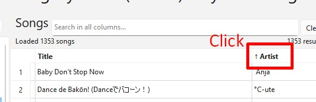
</p>

- You can drag a song from a playlist to the song filter to quickly find its CodeName, or drag a section/playlist to the locale filter to find its locale.

<p align="center">
   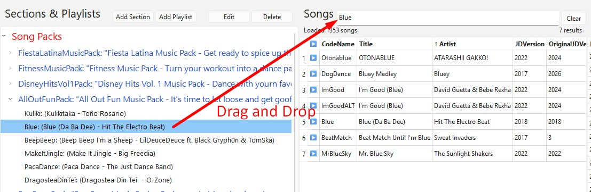
</p>
<p align="center">
   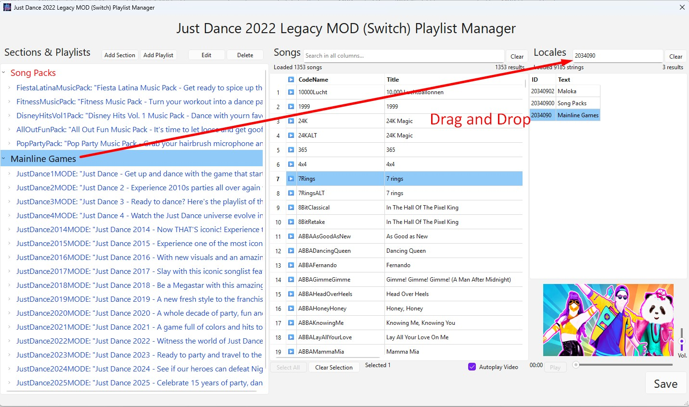
</p>
<p align="center">
    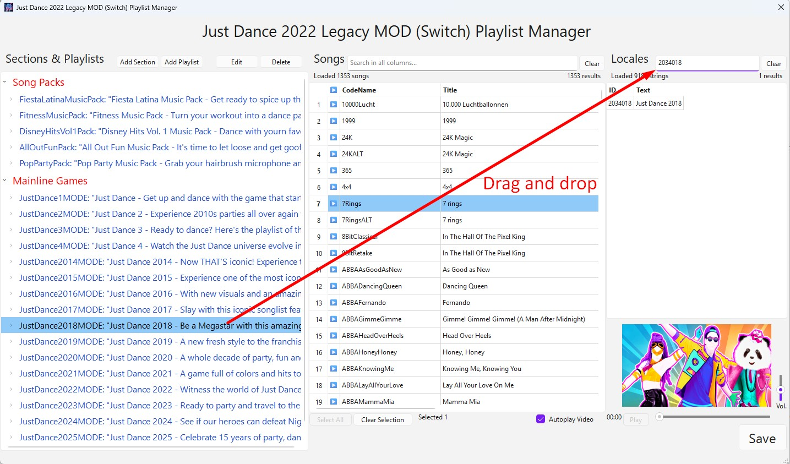
</p>

---

### Developer Info Box (CTRL+I)
When you select a row in the section/playlist tree or the song table and press CTRL+I, a text box will appear showing all information for that row. This is useful for developers to debug or inspect data.

<p align="center">
   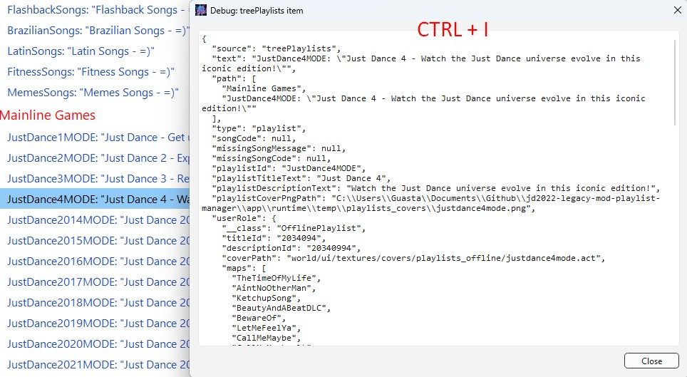
</p>

---

## FAQ
**Q1: Does this tool add new songs to the game?**  
A: No. It only manages and organizes playlists for songs that are already present in your MOD files. It does not bypass any game limitations or inject new audio/video assets.

**Q2: Is it compatible with other Just Dance versions?**  
A: No. It is specifically designed and tested for the Just Dance 2022 Legacy MOD on Nintendo Switch.

**Q3: Is it compatible with Legacy ONLINE?**  
A: No, it is only compatible with Just Dance 2022 Legacy MOD Switch Offline.

**Q4: Do you plan to make it compatible with the Legacy MOD for other Just Dance versions or consoles?**  
A: No, mainly because I don't play other versions or consoles, but the code is open source for anyone who wants to add more features.

**Q4: Will you update songs.json when the MOD creators add new songs?**  
A: As long as I'm still playing, probably yes. But I can't guarantee it forever. Anyway, the file updates itself after running load mode 3. So if you don't want to or can't extract the files on your PC, you can ask someone to extract and send you the updated file with the new CodeNames, or, if you know the necessary data, you can manually add the records by editing the [songs.json](app/runtime/songs.json).

**Q5: Why don’t the song’s audio and the coach’s video play together?**  
A: Honestly, I don’t know. For some reason, these files are separated inside the MOD (probably because the game reads them this way), so it wouldn’t make sense for me to “merge the two” just to display them together in the Playlist Manager.

**Q6: I got error X... What should I do?**  
A: Try to understand the error by checking the most recent .log file in [/runtime/logs/](app/runtime/logs). If you can't solve it, contact me here on GitHub or on Discord, sending the log file and explaining how you encountered the error. I can’t guarantee support for this project forever, but I might be able to help you.

## Contributing
We welcome contributions from anyone who wants to use this code to further enhance the project, whether by adding compatibilities with other versions or consoles, or implementing any other improvements. The only requirement is that the project's core purpose remains: a manager for Just Dance games. The project must stay 100% open source and free.

Check [app/src/README.md](app/src/README.md) for code info.

## Installation For Developers
If you wish to run from source, clone the repository, install dependencies and run:
   ```bash
   git clone [https://github.com/vguasta/jd-legacy-mod-playlist-manager.git](https://github.com/vguasta/jd-legacy-mod-playlist-manager.git)
   pip install -r ./app/requirements.txt
   python ./app/main.py
   ```
*Note: This project requires Python 3.10 for optimal performance and compatibility.*

## Credits

**Project Credits**

* **Project idea, [UI mockup](docs/images/UI_mockup.png), UI screens in Qt Designer for PySide6, and main logic for reading and saving MOD files:** Guasta
* **Most of the code:** Generated with GitHub Copilot (GPT-5.2-Codex)
* **Default playlist cover ([app/resources/assets/default_cover.png](app/resources/assets/default_cover.png)) and exe icon ([app/resources/gui/icon.jpg](app/resources/gui/icon.jpg))**: Generated by Grok AI
* **File extraction/conversion code adapted from:**
   * IPK files - [ubiart-archive-tools](https://github.com/PartyService/ubiart-archive-tools) by ***PartyService***
   * Textures/covers images - [NX-UbiArt-Texture-Maker](https://github.com/RN-JK/NX-UbiArt-Texture-Maker) by **RN-JK**
   * Localisation files - [ubiart-loc8-converter](https://github.com/wukko/ubiart-loc8-converter) by **wukko**
* **Testers:** Me and my friends: Bruno, Giulia and Kelvin

As a developer in the LGBTQIAPN+ 🏳️‍🌈 community of Just Dance fans, I'm very grateful to the LGBTQIAPN+ Just Dance fan community and the Legacy MOD creators for making Just Dance more accessible.

## Disclaimer
This project is an unofficial fan-made tool. It is **not** affiliated with, endorsed by, or associated with Ubisoft, Nintendo, or the creators of the Legacy MOD. The author does not distribute any copyrighted game assets or MOD files. Use it at your own risk; the author is not responsible for any damage to your game files or console.

## License
This project is licensed under the **MIT License**. See the [LICENSE](LICENSE) file for the full text.
